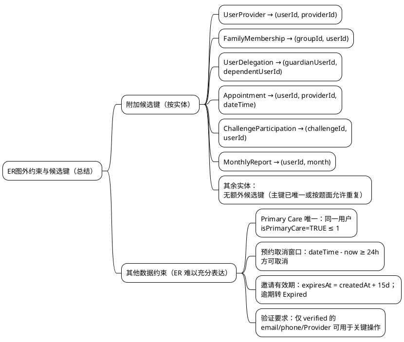

1. 附加候选键（按实体）
   * User：无（`healthId` 为唯一身份标识）。
   * ContactEmail：无（`email` 已为主键）。
   * Phone：无（`phoneNumber` 已为主键）。
   * Provider：无（`licenseNumber` 为唯一标识）。
   * Doctor / Specialist / Therapist：无（继承 `Provider.licenseNumber`）。
   * UserProvider：`(userId, providerId)`。
   * FamilyGroup：无（`name` 允许重复）。
   * FamilyMembership：`(groupId, userId)`。
   * UserDelegation：`(guardianUserId, dependentUserId)`。
   * Appointment：`(userId, providerId, dateTime)`。
   * Challenge：无（避免对相同目标/日期的不同挑战过度约束）。
   * ChallengeParticipation：`(challengeId, userId)`。
   * Invitation：无（时间与目标组合不作为强唯一键）。
   * MonthlyReport：`(userId, month)`。
   * HealthMetric：无（若限定“同一用户/类型/日期唯一”才可作为候选键）。

2. 其他数据约束（ER 图难以充分表达）
   * Primary Care 唯一：同一用户同时最多一条 `isPrimaryCare=TRUE`（条件唯一）。
   * 预约取消窗口：仅允许在预约时间前 ≥24 小时取消；取消需记录原因。
   * 邀请有效期：`expiresAt = createdAt + 15 days`；逾期转为 `Expired`，完成后不可再接受。
   * 验证要求：未验证的 `email/phone` 不得用于关键功能；仅验证通过的 `Provider` 可被正式关联或设为主治。

