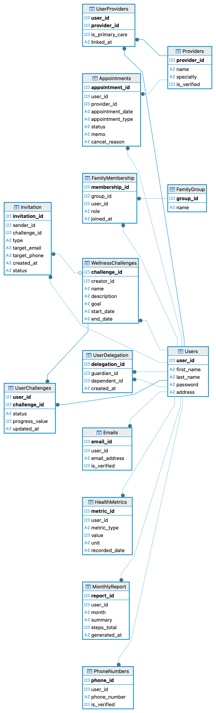

# 项目交付物 3 (Project Deliverable 3) - 最终报告

## 1. 项目概览
本项目旨在开发“健康追踪个人健康平台 (Health Track Personal Wellness Platform)”的完整应用程序系统。在第 3 阶段中，我们基于第 2 阶段的设计规范，构建了后端 API 服务和前端用户界面，并对数据库模式进行了必要的扩展和优化，以支持更复杂的业务逻辑，如家庭组、用户委托和邀请机制。

## 2. 数据库模式与构建 (SQL Database Construction)

### 2.1 数据库模式 (Schema)
我们使用 SQLite 作为关系型数据库。最终的数据库模式包含以下主要实体及其关系：

*   **核心用户数据**：
    *   `Users`: 存储用户基本信息（姓名、密码、地址）。
    *   `Emails` & `PhoneNumbers`: 存储用户的联系方式，支持一对多关系，并包含验证状态 (`is_verified`)。
*   **医疗服务**：
    *   `Providers`: 存储医疗保健提供者（医生）信息。
    *   `UserProviders`: 用户与提供者的多对多关联，包含是否为初级保健医生的标记 (`is_primary_care`)。
    *   `Appointments`: 存储预约记录，包含状态（Scheduled, Completed, Cancelled）、备注 (`memo`) 和取消原因。
*   **健康与挑战**：
    *   `HealthMetrics`: 存储用户的健康指标数据（如体重、血压、步数）。
    *   `WellnessChallenges`: 定义健康挑战（目标、起止日期）。
    *   `UserChallenges`: 追踪用户参与挑战的状态和进度。
*   **社交与家庭 (新增/优化)**：
    *   `FamilyGroup` & `FamilyMembership`: 支持家庭组功能，包含角色（Admin/Member）。
    *   `UserDelegation`: 实现监护人与被监护人（Dependent）的委托关系。
    *   `Invitation`: 管理加入家庭或挑战的邀请，包含状态流转（Pending/Accepted/Rejected）。
*   **报表**：
    *   `MonthlyReport`: 存储生成的月度健康摘要。

### 2.2 数据完整性与约束
*   **主键与外键**：所有表均定义了适当的主键和外键约束，确保引用完整性（如 `ON DELETE CASCADE`）。
*   **Check 约束**：
    *   预约状态、挑战状态、邀请状态均有限定值。
    *   日期约束（如挑战结束日期必须晚于开始日期）。
    *   委托关系中监护人不能是自己。
    *   邀请目标必须包含 Email 或 Phone 至少其一。
*   **Unique 约束**：
    *   用户与家庭组的唯一成员关系。
    *   监护人与被监护人的唯一对应关系。
    *   **部分唯一索引 (Partial Unique Index)**: 在 `UserProviders` 表上实现了 `WHERE is_primary_care = 1` 的唯一索引，确保每个用户至多只能有一位主治医生 (Primary Care Provider)。
*   **性能索引 (Performance Indexes)**:
    *   为了优化查询速度，我们在常用查询字段（如 `user_id`, `date`, `type`）上创建了非唯一索引。例如 `idx_appointments_user_id` 和 `idx_metrics_user_type_date`。

### 2.3 业务逻辑约束 (Application-Level Constraints)
除了数据库层面的约束外，我们在应用层 (Service Layer) 实现了以下关键业务规则，以满足 Phase 2 的设计要求：
*   **预约取消窗口**: `AppointmentService` 强制检查取消时间，若距离预约时间不足 24 小时，则禁止取消并抛出错误。
*   **邀请有效期**: `InvitationService` 在处理邀请响应时会检查创建时间，若超过 15 天则自动标记为 `Expired` 并禁止接受。
*   **验证要求**: `AccountService` 在链接医疗提供者时，会检查该提供者的 `is_verified` 状态，禁止链接未验证的提供者。

### 2.3 数据填充
我们编写了 `data.sql` 脚本，预置了 10 位用户及大量关联数据，涵盖了所有业务场景（预约、挑战、家庭关系、邀请等），确保系统启动即有丰富数据可供演示。

## 3. 应用程序开发 (Application Development)

### 3.1 技术栈
*   **后端**: Python Flask (提供 RESTful API)
*   **数据库**: SQLite
*   **前端**: Vue.js 3 + Vuetify (Material Design 风格 UI)

### 3.2 实现的功能模块

#### 3.2.1 主菜单与导航
应用程序实现了完整的导航系统，包含以下核心功能入口：
*   **Dashboard (仪表盘)**: 展示 BMI、活跃挑战、即将到来的预约、待处理邀请。
*   **Account (帐户)**: 个人信息管理。
*   **Appointments (预约)**: 预约管理。
*   **Challenges (挑战)**: 浏览和参与健康挑战。
*   **Family (家庭)**: 家庭组管理。
*   **Delegation (委托)**: 监护人与被监护人管理。
*   **Invitations (邀请)**: 处理收到的邀请。

#### 3.2.2 帐户功能 (Account Functions)
*   **个人详情**: 用户可以查看和编辑姓名、地址。
*   **联系方式**: 支持添加和删除多个电子邮件及电话号码。
*   **医疗提供者**: 用户可以浏览医生列表，并将其链接到自己的帐户（或解除链接）。

#### 3.2.3 预约功能 (Appointments)
*   **预约管理**: 用户可以创建新预约，查看历史预约。
*   **状态更新**: 支持取消预约（需填写原因）和添加备注 (`memo`)。
*   **搜索与筛选**: 后端实现了基于时间范围、提供者、类型的搜索逻辑。

#### 3.2.4 健康挑战 (Wellness Challenges)
*   **创建与参与**: 用户可以创建新的挑战供他人参与，或加入现有的挑战。
*   **进度追踪**: 用户可以更新自己在挑战中的进度值。
*   **活跃度统计**: Dashboard 实时显示当前活跃的挑战数量。

#### 3.2.5 摘要与分析功能 (Summary & Analytics)
*   **Dashboard**: 
    *   自动计算并展示 **BMI**（基于最新的身高体重记录）。
    *   展示 **即将到来的预约** (Top 3)。
    *   展示 **进行中的挑战** 及其进度。
    *   展示 **待处理的邀请** 数量。
*   **健康指标管理 (Health Metrics)**:
    *   新增了独立的 **Health Metrics** 页面，允许用户查看历史健康数据列表。
    *   支持添加多种类型的健康指标（如体重、身高、血压、步数、心率、睡眠时间等），系统会自动记录单位和时间。
    *   支持删除错误的健康记录。
*   **月度报告 (Monthly Reports)**:
    *   实现了自动化的月度报告生成逻辑。系统会定期（或按需）聚合用户当月的健康数据（平均体重、平均血压、总步数）和预约统计。
    *   用户可以在前端查看历史月度报告摘要。

#### 3.2.6 新增高级功能 (Phase 3 Additions)
*   **家庭组 (Family)**: 
    *   实现了家庭组的创建、成员管理（管理员/成员角色）。
    *   **逻辑增强**: 限制每位用户只能加入一个家庭群組。若用户已在群组中，必须先离开才能接受新的家庭邀请。
    *   **管理员保护**: 当唯一的管理员尝试离开群组时，系统会强制要求先指派新的管理员，防止群组变为无主状态。
*   **委托 (Delegation)**: 实现了监护人添加被监护人（Dependent）的功能，支持通过下拉列表搜索用户。
*   **邀请系统 (Invitations)**: 实现了完整的邀请流程。用户可以发送挑战邀请或家庭邀请，接收者可以在系统中选择“接受”或“拒绝”。
*   **验证与安全 (Verification & Security)**:
    *   **登录保护**: 实现了强制邮箱验证检查。用户登录时，系统会检查关联邮箱的 `is_verified` 状态，未验证邮箱无法登录。
    *   **状态可视化**: 在前端帐户页面，邮箱、电话号码和医疗提供者均会显示 "Verified"（绿色）或 "Unverified"（黄色）标签，让用户清晰了解验证状态。

#### 3.2.7 系统健壮性 (System Robustness)
*   **全局错误处理**: 为了防止后端抛出原始 HTML 错误页面破坏前端 JSON 解析，我们在 `app/__init__.py` 中实现了全局错误处理器 (`@app.errorhandler`)。无论是数据库完整性错误 (`sqlite3.IntegrityError`) 还是通用服务器错误，系统都会捕获并返回结构化的 JSON 错误信息 (HTTP 400/500)，极大提升了系统的稳定性和调试效率。

## 4. 实施过程中的问题与解决方案

### 4.1 数据库模式的演进
*   **问题**: 初始设计中对于“家庭”和“委托”关系描述较为抽象，缺乏具体的表结构支持。
*   **解决方案**: 在 Phase 3 中，我们显式添加了 `FamilyGroup`, `FamilyMembership`, `UserDelegation` 表，并引入了 `Invitation` 表来解耦“加入”这一动作，使得用户体验更加流畅（先邀请，后确认）。
*   **问题**: `PhoneNumbers` 表原本设计了 `UNIQUE(user_id)` 约束，导致用户无法添加多个电话号码。
*   **解决方案**: 移除了该唯一性约束，允许用户在 `Account` 页面管理多个联系电话。

### 4.2 复杂查询与性能
*   **问题**: Dashboard 需要聚合多张表的数据（指标、预约、挑战、邀请），如果分多次 API 调用会导致前端加载缓慢。
*   **解决方案**: 在后端 `SummaryService` 中封装了聚合逻辑，一次性查询所有必要数据（BMI 计算、计数统计、列表获取），并通过单一 API `/summary` 返回给前端，提高了页面加载速度。
*   **数据库索引优化**:
    *   针对随着数据量增长可能出现的查询延迟，我们在 `schema.sql` 中添加了多个索引（Index）。
    *   为了验证索引的有效性，我们编写了 `check_index.py` 脚本，使用 `EXPLAIN QUERY PLAN` 分析 SQL 执行计划。测试结果表明，关键查询（如获取最新健康指标、查询预约列表）已从全表扫描 (SCAN TABLE) 优化为索引查找 (SEARCH TABLE USING INDEX)。

### 4.3 数据一致性
*   **问题**: 删除用户时，相关的预约、挑战记录、家庭成员关系可能会变成孤儿数据。
*   **解决方案**: 在数据库层广泛使用了 `ON DELETE CASCADE` 约束，确保当用户被删除时，其所有关联数据自动清理，维护了数据库的整洁和一致性。

## 5. 对第 2 阶段规范的修订 (Revisions from Phase 2)

1.  **新增 Invitation 实体**: 原规范可能隐含了直接添加成员的逻辑，我们将其修订为“邀请-确认”机制，增加了 `Invitation` 表，以符合更真实的隐私和安全需求。
2.  **细化 Delegation 模型**: 明确了 `UserDelegation` 表，区分 `guardian_id` 和 `dependent_id`，并添加了防止自我委托的约束。
3.  **增强 Dashboard**: 原规范对摘要功能的描述较为基础，我们在实现中增加了 BMI 自动计算、待处理事项提醒等更具交互性的功能。
4.  **字段扩展**: 在 `Appointments` 中增加了 `memo` 和 `cancel_reason`，在 `Users` 相关的联系方式表中增加了 `is_verified` 字段，以支持更完善的业务流程。

---
**总结**: 本项目已成功完成了所有既定目标，并在此基础上进行了功能增强，交付了一个功能完备、逻辑严密且用户友好的健康追踪平台。
